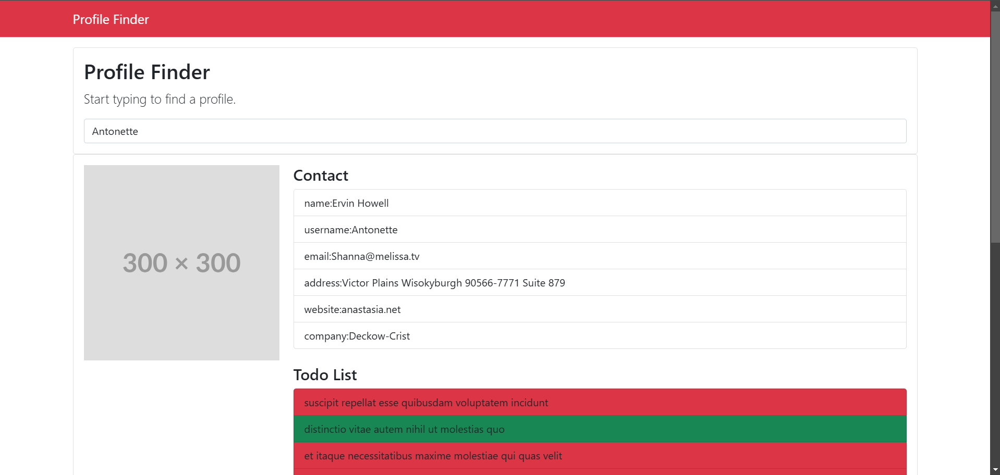

# 🔍 Profil Finder

Kullanıcıların platformlar üzerindeki profillerini ve bu profillerin todo listlerini kolayca arayıp listeleyebileceği, api kullanarak yapılmış basit ve kullanışlı bir profil bulucu uygulaması.

## 📌 Proje Konusu

Bu proje, kullanıcıların **girdiği kullanıcı adı veya bağlantı** ile belirlenen platformlarda hızlıca profil bulmasını sağlar.

## 🎯 Neden Geliştirildi?

Bu projeyi geliştirme motivasyonum:  
✅ **API kullanımı** ve dış veri kaynaklarından veri çekme konusunda deneyim kazanmak  
✅ **JavaScript ile asenkron işlemler** (fetch API) ve **Promise** yapısını kullanarak veri çekme pratiği yapmak  
✅ **Arayüz geliştirme** becerilerimi geliştirmek ve **dinamik içerik yönetimi** sağlamak  

## 🚀 Ne Öğrendim?

Bu projeyi geliştirirken aşağıdaki konularda bilgi ve deneyim kazandım:  

- **JavaScript Fetch API** ile platform verilerini çekme  
- **Asenkron işlemler ve Promise yapısı** ile hızlı veri işleme  
- **DOM Manipülasyonu** ile arama kutusu ve sonuçları yönetme  
- **Kullanıcı giriş doğrulama** ile hatalı veya eksik girişleri engelleme  
- **Responsive tasarım** ile farklı cihazlara uyum sağlama  

## 🔥 Özellikler

✅ Kullanıcı adı veya bağlantı ile profil arama  
✅ **Platform seçme** özelliği  
✅ **Gerçek zamanlı arama**  
✅ **Profil bilgilerini listeleme**  
✅ **Kullanıcı dostu bir arayüz**  

## 🔧 Kullanılan Teknolojiler

- **HTML5** - Yapıyı oluşturmak için  
- **CSS3** - Responsive ve şık tasarım için  
- **JavaScript (ES6+)** - API’den veri çekme, veri işleme ve dinamik içerik  
- **Fetch API** - Harici verileri çekmek için  
- **Local Storage** - Kullanıcı arama geçmişini saklamak için  

## 🖥 Ekran Görüntüleri

